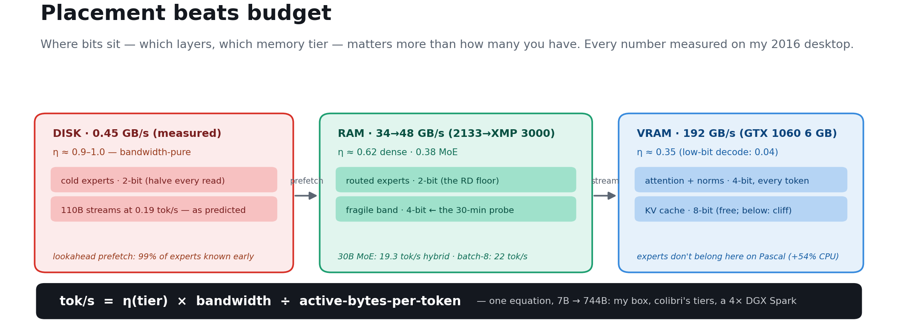
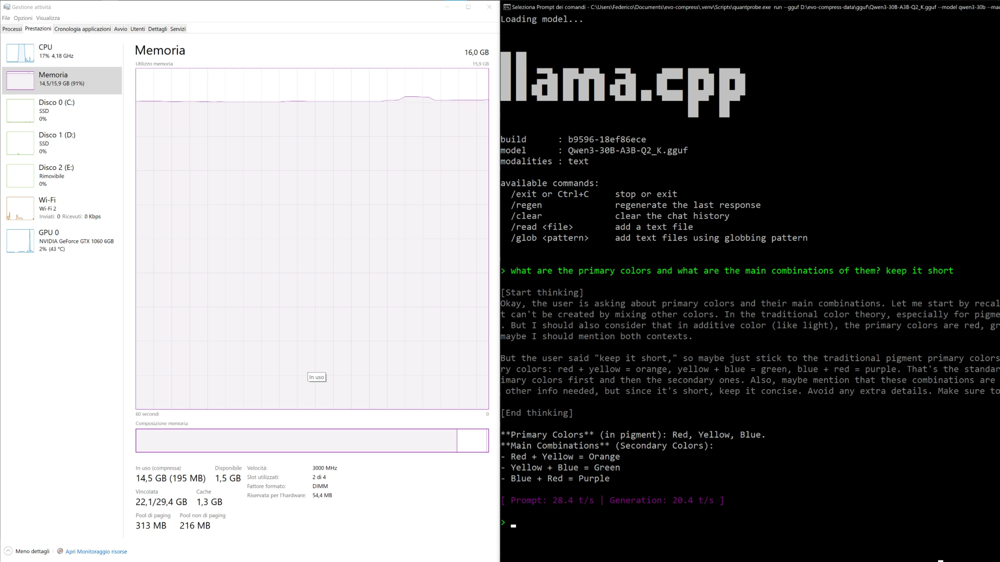
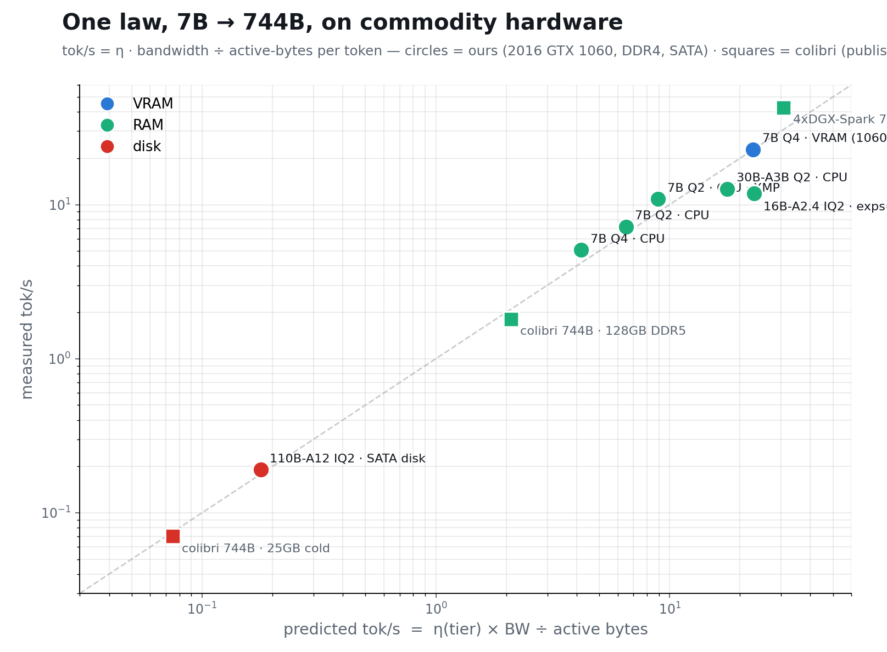
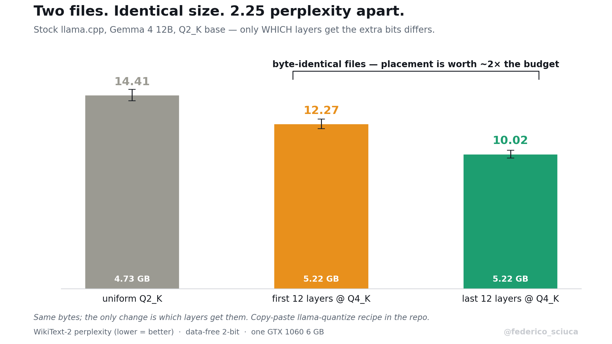
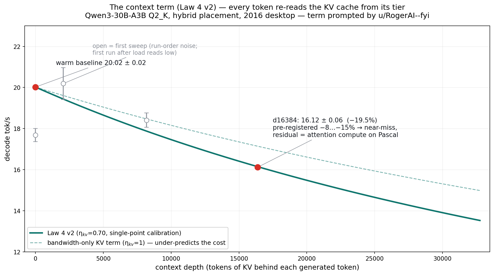

# quantprobe

### Placement beats budget

**Where your bits sit — which layers, which memory tier — matters more than how many you have. Four falsification-tested laws for running big LLMs on hardware you already own, every number measured on one 2016 desktop (GTX 1060 6 GB · 16 GB DDR4 · SATA SSD).**

     [](https://x.com/federico_sciuca)

<p align="center"></p>

> **▶ Try the interactive calculator: [Will it run — and how fast?](https://federicots.github.io/quantprobe/)**
> Pick any model + your machine → predicted tok/s, memory fit, quality cost, and your cheapest next upgrade — from the law below, with your config plotted against every validated measurement.


**New here? → [QUICKSTART.md](QUICKSTART.md) gets you running in 60 seconds — or just `pip install quantprobe && quantprobe auto qwen3-coder --run`.** The calculators (`hw`/`plan`/`target`/`optimize`) need nothing installed; the weight-touching commands drive [llama.cpp](https://github.com/ggml-org/llama.cpp/releases) (point quantprobe at it with `--llama-dir`, `QUANTPROBE_LLAMA_DIR`, or `PATH`; preview anything with `--dry`). 16 machine presets ship in (`--machine`): GTX 1060 → RTX 5090, Apple `mac-m2/m3/m4-*`, DGX Spark, Epyc — or pass raw specs. Multi-GPU / RAID? Comma lists aggregate: `--vram 24,24 --disk-bw 14,14`. Big-VRAM + disk-streaming rigs get the three-tier expert-cache row (v1.3).


---

## What this is

My 2016 desktop can't run frontier models the way a datacenter does — so instead of brute force, I asked *where* every bit and byte should go, and answered it by measurement. Months of experiments later, the result is four laws, a 30-minute probe tool, copy-paste llama.cpp recipes, and one equation that predicts decode speed from 7B to 744B — validated against my own pre-registered predictions and against [colibri](https://github.com/JustVugg/colibri)'s independently published 744B numbers.

## Headline results

| result | number |
|---|---|
| 16B MoE, 2-bit, **data-free**, resident on a 6 GB card | ppl 6.31 → 6.96 (**1.10×**) — beats calibrated SOTA's gap-ratio |
| Same bytes, different layers (Gemma 4 12B, stock llama.cpp) | **byte-identical files, 2.25 ppl apart** (12.27 vs 10.02) |
| Gemma 4 12B depth-aware 2-bit | 1.91× → **1.45×** quality cost, ~4.5 GB resident |
| Qwen3-30B-A3B on the 2016 desktop | **19.3 tok/s** — hybrid placement, *predicted 19 before measuring* |
| GLM-4.5-Air **110B** from a SATA drive, 16 GB RAM | 0.19 tok/s — inside the law's pre-registered 0.2–0.3 band |
| RAM overclock (XMP, 2133→3000) | dense **+52%**, pre-registered ×1.41+ |

## Why the evidence is unusually strong

Most benchmark posts report what happened. I report what I **predicted before it happened** — I wrote the number down, then ran the hardware, and this is the strongest form of empirical evidence I know how to produce:

| prediction (made first) | measured (after) |
|---|---|
| 110B streamed from SATA: **0.2–0.3 tok/s** | **0.19** |
| RAM overclock scales in-RAM decode **×1.41+** | **×1.52** |
| 30B hybrid placement: **~19 tok/s** | **19.30 ± 0.88** |
| a day-old 118B (Laguna S 2.1) streamed from this SATA drive: **0.2–0.4** ([staked pre-download](preregistrations/2026-07-23-laguna-s-2.1-on-2016-desktop.md)) | **0.38 ± 0.17** |
| colibri's own 128 GB / 25 GB tiers, from our η bands | land **inside** the bands |

Add to that: a **byte-identical control** (two GGUFs the same size, 2.25 ppl apart — only placement differs), a full **claim → script → log manifest** (every number reproducible in-tree), and a set of **documented dead ends** (dynamic top-k, semantic paging, self-speculation — all measured-dead, because a law you only confirm is a law you haven't tested).

<p align="center"></p>
<p align="center"><em>One frame, no cuts: Task Manager (16 GB @ 3000 MT/s, GTX 1060 6 GB, RAM at 91% — the hybrid placement using the whole machine) beside llama.cpp chatting Qwen3-30B-A3B at <b>20.4 tok/s generation</b> — above the pre-registered 19. Raw logs, hardware attestation + GGUF SHA256: <a href="weights/data/validation_19tok/EVIDENCE.txt">EVIDENCE.txt</a>. Third bench run: 19.26 ± 0.45 (series 19.30 → 19.55 → 19.26).</em></p>

**Open pre-registrations** — predictions staked publicly *before* measurement: [colibri v1.1, five falsifiable predictions (2026-07-23)](preregistrations/2026-07-23-colibri-v1.1.md) — dual-SSD scaling, int3 speedup, lattice-vs-scalar, AVX-512 tier-scoping, MTP×MoE antagonism — plus open bands on the CPU-only context slope and expert-pruning decode ([all verdicts](preregistrations/)).


## The four placement laws

Full statements, each with its establishing measurement and a falsifiable prediction, in **[LAWS.md](LAWS.md)**.

1. **Rotation is rank-conditional.** Incoherence rotation (QuIP#/QTIP/QuaRot) helps full-rank tensors (+0.006 ppl) and destroys low-rank bottlenecks (+1623 ppl) — a ~270,000× swing on effective rank alone.
2. **Trained networks are dense everywhere.** Experts sit *exactly* at the rate-distortion floor; routing is flat (even across domains — Jaccard 1.00 prose vs code); activations are diffuse. **2-bit is the floor.**
3. **Fragility is measurable, not predictable.** Gemma late-fragile 4×, Mistral **early-fragile 25×** — architectural near-twins pointing opposite ways. Weight statistics mislead. **Only a 30-minute functional probe decides.**
4. **The tiered decode law.** `tok/s = η(tier)·BW ÷ active-bytes`, η collapsing per tier across 7B→744B and both projects' hardware. **v1.1 adds the context term**: each generated token also re-reads the whole KV cache from *its* tier — `--ctx` prices it, `bench --depth` measures it (measured here: 20.02 → 16.12 tok/s at 16k depth).

<p align="center"></p>

<p align="center"></p>
<p align="center"></p>


## Install — and the eleven commands

```bash
pip install quantprobe
quantprobe auto qwen3-coder --tps 15 --run   # empty machine -> optimal quant chosen, fetched, chatting
```

**Zero-config on your own box**: `quantprobe plan --gguf model.gguf` auto-detects the machine and reads the model from the file. Presets/flags estimate any *other* machine. `hw`/`plan`/`target`/`optimize` need nothing else installed (`auto` needs network for the fetch); the rest drive stock [llama.cpp](https://github.com/ggml-org/llama.cpp/releases) (point at it with `--llama-dir`/`QUANTPROBE_LLAMA_DIR`/`PATH`; preview any command with `--dry`).

```bash
quantprobe auto qwen3-30b --tps 15                       # ONE command: optimizer picks bits, closest quant fetched, run command printed
quantprobe auto qwen3-30b --custom                       # THE PRODUCT: probe YOUR model, build its personalized depth-aware GGUF
quantprobe hw                                            # what the law sees on THIS machine (every value source-tagged)
quantprobe plan     --gguf model.gguf                    # zero-config prediction: placement + tok/s + the launch command
quantprobe optimize --tps 20                             # CHEAPEST PATH to a target: bits x placement x hardware, Pareto-ranked
quantprobe target   --tps 5 --machine gaming --ladder    # inverse: target -> smartest model + speed-intelligence ladder
quantprobe fetch    qwen3-30b ./models                   # robust, resumable download
quantprobe quantize --gguf f16.gguf --out 2bit.gguf      # COMPRESS: depth-aware ~2-bit GGUF (verified: loads + generates)
quantprobe probe    --gguf f16.gguf --eval wiki.test.raw # measure YOUR model's fragile band (~30 min); --apply builds it
quantprobe run      --gguf 2bit.gguf                     # plan the placement, then LAUNCH llama.cpp chat
quantprobe bench    --gguf 2bit.gguf --contribute        # predicted vs measured on your box; opt-in datapoint
quantprobe dashboard --gguf 2bit.gguf                    # the law LIVE: neuron galaxy + thinking toggle, every reply scored vs prediction
```

The loop is self-validating: `plan` predicted 17.5 for a file we then measured at **18.32 ± 0.17**; the config months of research converged to is what `optimize` picks blind. A measured example of what that's worth: the same model, mis-specified vs law-routed, is **3.38 vs 18.32 tok/s (×5.4)** — [worked examples](docs/EXAMPLES.md).

## Help grow the law

`quantprobe bench --contribute` prints exactly what would be shared (hardware label, model, predicted-vs-measured) plus a pre-filled issue link — **you review and submit; nothing is ever sent automatically**. Contributed points land on the law chart; the ones *outside* the bands are the most valuable. Open falsifiable predictions anyone can settle: [preregistrations/](preregistrations/).

## Deep dives

| | |
|---|---|
| [QUICKSTART.md](QUICKSTART.md) | 60-second start, three levels; recipes (own fine-tune, coding agents, hardware buying); Ollama interop |
| [LAWS.md](LAWS.md) | the four laws — statements, measurements, falsifiable predictions, the general form |
| [docs/EXAMPLES.md](docs/EXAMPLES.md) | worked examples with real outputs: zero-config, the ×5.4 optimizer A/B, probe walkthrough, troubleshooting |
| [docs/HARDWARE.md](docs/HARDWARE.md) | the 2016 box: exact specs, measured bandwidths, what the next euro buys |
| [docs/DEEP-DIVE.md](docs/DEEP-DIVE.md) | what's new vs. what's built-on, parity tables, the 744B-at-home projection, repository map |
| [preregistrations/](preregistrations/) | every staked prediction with its verdict — hits, the near-miss, and the honest miss |
| [papers/arxiv/](papers/arxiv/) | the paper (submission-ready LaTeX) |
| [CHANGELOG.md](CHANGELOG.md) | v1.0 → v1.5, every release |

## Honest limitations

- Perplexity on WikiText-2 is my primary metric; I haven't run task-level evals (MMLU/HellaSwag) yet.
- My fragility atlas covers four model families — enough to *disprove* universality, not to chart every architecture.
- 0.19 tok/s for a 110B is a **capacity demonstration, not usable inference** — the honest speed only arrives with faster storage.
- Speed numbers are single-stream decode on one machine (±25% across environments); the tiered-decode η values are fitted, not derived.
- No custom runtime: everything rides stock llama.cpp and streaming eval harnesses. The one CUDA kernel is verified in reference, not built.


## Credits

[colibri](https://github.com/JustVugg/colibri) (744B on 25 GB, pure C) inspired the tier-streaming exploration. The quantization stack builds on [llama.cpp](https://github.com/ggml-org/llama.cpp) and the QTIP/QuIP# incoherence codecs — whose central tool our first law bounds. Independent research by Federico Sciuca, AI-supported, on one desktop; every claim is measured, and every negative that redirected the work is documented. The Law 4 context term (v1.1) was prompted by **u/RogerAI--fyi** (Reddit), who correctly observed the original formulation omitted per-token KV reads — measured, confirmed, and shipped within a day.

## License

MIT — see [LICENSE](LICENSE). © 2026 Federico Sciuca.
