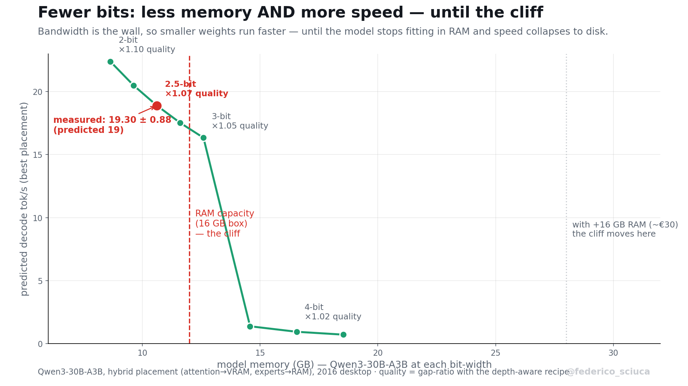
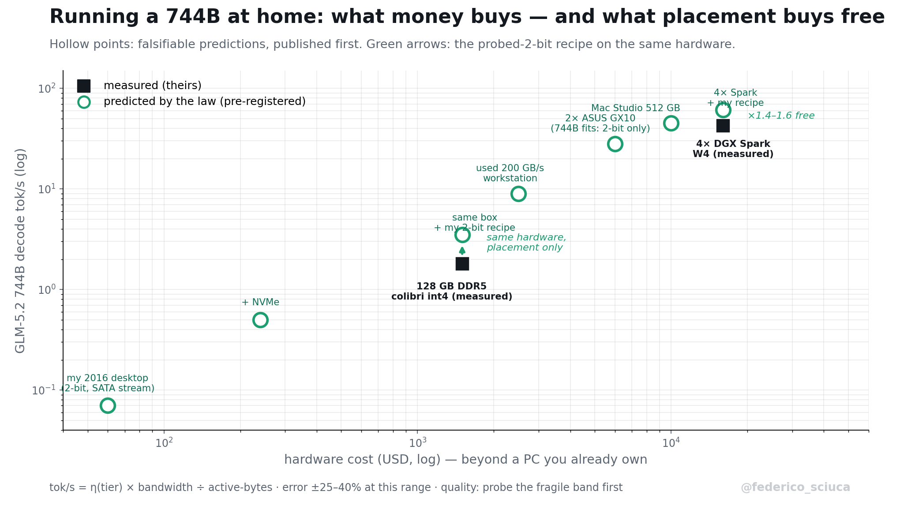
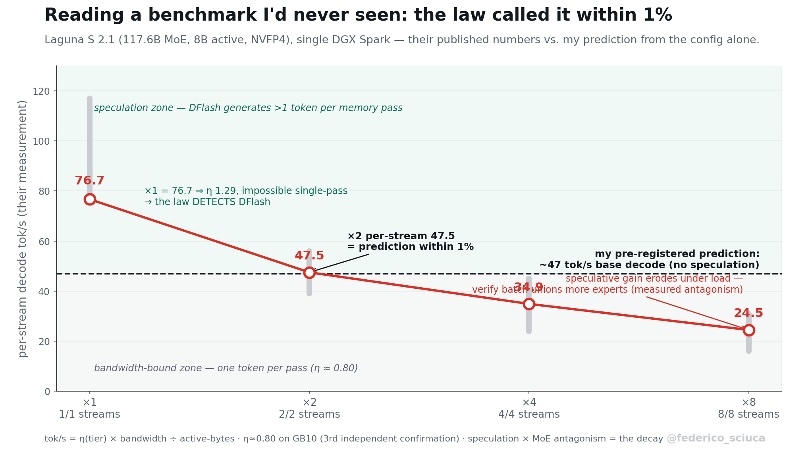

# quantprobe

### Placement beats budget

**Where your bits sit — which layers, which memory tier — matters more than how many you have. Four falsification-tested laws for running big LLMs on hardware you already own, every number measured on one 2016 desktop (GTX 1060 6 GB · 16 GB DDR4 · SATA SSD).**

     [](https://x.com/federico_sciuca)

<p align="center"></p>

> **▶ Try the interactive calculator: [Will it run — and how fast?](https://federicots.github.io/quantprobe/)**
> Pick any model + your machine → predicted tok/s, memory fit, quality cost, and your cheapest next upgrade — from the law below, with your config plotted against every validated measurement.

---

## What this is

My 2016 desktop can't run frontier models the way a datacenter does — so instead of brute force, I asked *where* every bit and byte should go, and answered it by measurement. Months of experiments later, the result is four laws, a 30-minute probe tool, copy-paste llama.cpp recipes, and one equation that predicts decode speed from 7B to 744B — validated against my own pre-registered predictions and against [colibri](https://github.com/JustVugg/colibri)'s independently published 744B numbers.

## Headline results

| result | number |
|---|---|
| 16B MoE, 2-bit, **data-free**, resident on a 6 GB card | ppl 6.31 → 6.96 (**1.10×**) — beats calibrated SOTA's gap-ratio |
| Same bytes, different layers (Gemma 4 12B, stock llama.cpp) | **byte-identical files, 2.25 ppl apart** (12.27 vs 10.02) |
| Gemma 4 12B depth-aware 2-bit | 1.91× → **1.45×** quality cost, ~4.5 GB resident |
| Qwen3-30B-A3B on the 2016 desktop | **19.3 tok/s** — hybrid placement, *predicted 19 before measuring* |
| GLM-4.5-Air **110B** from a SATA drive, 16 GB RAM | 0.19 tok/s — inside the law's pre-registered 0.2–0.3 band |
| RAM overclock (XMP, 2133→3000) | dense **+52%**, pre-registered ×1.41+ |

## Why the evidence is unusually strong

Most benchmark posts report what happened. I report what I **predicted before it happened** — I wrote the number down, then ran the hardware, and this is the strongest form of empirical evidence I know how to produce:

| prediction (made first) | measured (after) |
|---|---|
| 110B streamed from SATA: **0.2–0.3 tok/s** | **0.19** |
| RAM overclock scales in-RAM decode **×1.41+** | **×1.52** |
| 30B hybrid placement: **~19 tok/s** | **19.30 ± 0.88** |
| colibri's own 128 GB / 25 GB tiers, from our η bands | land **inside** the bands |

Add to that: a **byte-identical control** (two GGUFs the same size, 2.25 ppl apart — only placement differs), a full **claim → script → log manifest** (every number reproducible in-tree), and a set of **documented dead ends** (dynamic top-k, semantic paging, self-speculation — all measured-dead, because a law you only confirm is a law you haven't tested).

## The four placement laws

Full statements, each with its establishing measurement and a falsifiable prediction, in **[LAWS.md](LAWS.md)**.

1. **Rotation is rank-conditional.** Incoherence rotation (QuIP#/QTIP/QuaRot) helps full-rank tensors (+0.006 ppl) and destroys low-rank bottlenecks (+1623 ppl) — a ~270,000× swing on effective rank alone.
2. **Trained networks are dense everywhere.** Experts sit *exactly* at the rate-distortion floor; routing is flat (even across domains — Jaccard 1.00 prose vs code); activations are diffuse. **2-bit is the floor.**
3. **Fragility is measurable, not predictable.** Gemma late-fragile 4×, Mistral **early-fragile 25×** — architectural near-twins pointing opposite ways. Weight statistics mislead. **Only a 30-minute functional probe decides.**
4. **The tiered decode law.** `tok/s = η(tier)·BW ÷ active-bytes`, η collapsing per tier across 7B→744B and both projects' hardware.

<p align="center"></p>
<p align="center"></p>

<p align="center"></p>

## The machine — and every speed it ran at

All of this happened on one desktop I already owned. Exact specs, because reproducibility starts with honesty about hardware:

| component | spec | measured bandwidth / effect |
|---|---|---|
| CPU | Intel i5-7600K (4c/4t, 2017) | MoE decode saturates at 2 threads (memory-bound, measured) |
| GPU | GTX 1060 6 GB (Pascal, 2016) | 192 GB/s VRAM · η ≈ 0.35 at ≥4-bit, **0.04 at 2-bit** (decode-util collapse, measured) |
| RAM | 16 GB DDR4 Corsair Vengeance | **2133 MT/s → 3000 (XMP): dense +52%, MoE +32% — pre-registered ×1.41, measured ×1.52** |
| SSD | Crucial MX500 (SATA) | 0.45 GB/s sequential (measured) — the 110B streaming tier |
| PCIe | 3.0 ×16 | 12.2 GB/s host→device (measured) |

The RAM line is the story in miniature: one free BIOS toggle, predicted in advance by the law, delivered within 8% — and it *moved the bottleneck* (the 30B went from bandwidth-bound to capacity-bound, exactly as a tiered system should behave).

### Projections — what the law says the next euro buys

| upgrade | cost (mid-2026 market*) | predicted effect |
|---|---|---|
| +16 GB DDR4 | ~€35–50 used · €90–130 new | 30B hybrid leaves the RAM boundary → stable ~19–21 tok/s; caches half a 110B |
| NVMe SSD, 1 TB (Gen3 ×4 is enough — board caps there) | ~€150–190 new right now; worth waiting for <€100 deals | disk tier 0.45 → ~3.5 GB/s: the 110B goes 0.19 → **~1.5 tok/s** |
| Both | ~€200–320 at today's prices | a 2016 desktop serving a 30B at reading speed and a 110B at demo speed |

\* The 2026 AI-driven NAND/DRAM shortage has inflated component prices (~2× the 2024 floor) and they're volatile — the used DDR4 market is the value play, and NVMe deals reward patience. The *predictions* don't change with the prices; when the hardware arrives, measured numbers go in this table next to them.

## Quickstart — zero to chatting, three commands

Prerequisite: [llama.cpp binaries](https://github.com/ggml-org/llama.cpp/releases) on PATH (or pass `--llama-dir`).

```bash
pip install git+https://github.com/FedericoTs/quantprobe   # (PyPI release pending)
quantprobe fetch qwen3-30b ./models                # known-good GGUF, robust download (~10.5 GB)
quantprobe run --gguf ./models/Qwen3-30B-A3B-Q2_K.gguf --model qwen3-30b --machine 2016-xmp
```

That last command plans the optimal placement for your machine, prints the prediction, and drops you into chat. Don't know your machine preset? `quantprobe plan --model qwen3-30b --vram 8 --vram-bw 300 --ram 32 --ram-bw 50 --disk-bw 2` takes raw numbers. Don't know what model to pick? `quantprobe target --tps 5 --machine 2016-xmp --ladder`.

## Install

```bash
pip install git+https://github.com/FedericoTs/quantprobe
```

Three commands, each implementing a law:

```bash
quantprobe plan  --model qwen3-30b --machine 2016-xmp     # Law 4: best placement + predicted tok/s + the command
quantprobe fetch unsloth/Qwen3-30B-A3B-GGUF ./models Qwen3-30B-A3B-Q2_K.gguf   # robust download
quantprobe run   --gguf model.gguf --model qwen3-30b --machine 2016-xmp        # plan, then LAUNCH llama.cpp chat with the optimal flags
quantprobe bench --gguf model.gguf --model qwen3-30b --machine 2016-xmp        # measure YOUR box: predicted vs measured, file-calibrated
quantprobe probe --gguf model-f16.gguf --eval wiki.test.raw                    # Law 3: fragility curve -> depth-aware recipe
quantprobe dashboard --gguf model.gguf --model qwen3-30b --machine 2016-xmp    # THE LAW, LIVE: chat in your browser while every reply is scored predicted-vs-measured
quantprobe target --tps 5 --machine 2016-xmp --ladder                          # INVERSE: "I need 5 tok/s - what's the smartest model I can run?" + the speed-intelligence ladder
```

The loop is self-validating: `plan` predicts 18.9 tok/s for the config we measured at 19.30 ± 0.88; `bench` on a 7B smoke test landed within 7% of its file-calibrated prediction. Run `bench` on your machine and you've tested the law yourself.

## Probe, then quantize (30 minutes, any GGUF)

```bash
quantprobe probe --gguf your-model-f16.gguf --eval wiki.test.raw
```

Quantizes one FFN band to Q2_K at a time, measures perplexity per band, and prints the fragility curve **plus the ready-to-run depth-aware recipe**. Stock llama.cpp, no code changes, no calibration data. Example (Gemma 4 12B — the byte-identical winner):

```bash
llama-quantize \
  --tensor-type "blk\.([0-9]|[12][0-9]|3[0-5])\.ffn_.*=q2_k" \
  --tensor-type "blk\.(3[6-9]|4[0-7])\.ffn_.*=q4_k" \
  --tensor-type "attn_.*=q4_k" --token-embedding-type q4_k \
  gemma-4-12B-f16.gguf out-depthaware.gguf Q2_K 8
```

More recipes + the full fragility atlas: **[weights/GGUF_DEPTH_RECIPE.md](weights/GGUF_DEPTH_RECIPE.md)**.

## What to expect on first run

`quantprobe probe` on a 12B takes ~30 min and prints a curve like this — the spike is the fragile band, and the recipe follows automatically:

```
quantprobe probe: gemma-4-12B-f16.gguf | 48 layers -> 4 bands
[2/3] band probe (one band's FFNs -> Q2_K at a time)
  layers 0-11 : PPL 9.51  (delta +2.14)
  layers 12-23: PPL 10.59 (delta +3.22)
  layers 24-35: PPL 10.53 (delta +3.16)
  layers 36-47: PPL 15.35 (delta +7.98)   <- fragile band
[3/3] recipe: protect layers 36-47 at Q4_K
  llama-quantize --tensor-type "blk\.(3[6-9]|4[0-7])\.ffn_.*=q4_k" ...
```

`quantprobe plan`/`target`/`run` are instant (they compute from the law). `quantprobe bench` runs a real llama-bench and prints predicted-vs-measured. Validated on **llama.cpp b9596+** (needs `--tensor-type` regex support).

## Troubleshooting

Every row here is a bug I actually hit and diagnosed — the table is the scar tissue.

| symptom | cause | fix |
|---|---|---|
| `llama-quantize: failed to quantize` from a Q6/Q8 source | requantizing an already-quantized GGUF | add `--allow-requantize` (quantprobe does this automatically) |
| hybrid MoE placement *slower* than pure CPU | full-file `mmap` + CUDA staging thrash a tight RAM box | use `--no-mmap` (quantprobe's `run` emits it for hybrids) |
| bench numbers wildly unstable (±3 on a 30B) | benching two >8 GB models back-to-back, or a cold page cache | warm-up pass first, then measure; don't bench big models back-to-back |
| post-reboot benches read low for ~10 min | antivirus first-read scan + cold cache | run once to warm, discard it, then measure |
| `ModuleNotFoundError: sentencepiece` on conversion | some tokenizers need it and it isn't a hard dep | `pip install sentencepiece` |
| perplexity step OOMs on a big model | too many GPU layers for 6 GB | lower `--ngl` (e.g. `--ngl 0` for pure CPU) |
| the GPU makes a MoE *slower*, not faster | Pascal-class low-bit decode collapses (η≈0.04 at 2-bit) | serve experts from CPU: `-ot "exps=CPU"` — often +54% |

## What's actually new here — and what isn't

**Not mine (I build on it, gratefully):** [llama.cpp](https://github.com/ggml-org/llama.cpp) and its k-quants; the incoherence-codec line (QuIP#/QTIP/QuaRot); [colibri](https://github.com/JustVugg/colibri)'s tier-streaming engine, which inspired the streaming experiments.

**Mine (measured here, to my knowledge first):**
1. The four laws — rank-conditional rotation, density-everywhere, probe-not-predict fragility, and the tiered decode equation with fitted η bands.
2. **Probe-then-quantize** as a method + the `quantprobe` tool implementing it end-to-end.
3. The **byte-identical placement experiment** (same size, 2.25 ppl apart) — the cleanest control I've seen for placement effects.
4. **Pre-registration as methodology** for systems benchmarks (predict → then measure, in public).
5. The depth-aware GGUF recipes, the placement solver (forward + inverse), and the live self-scoring dashboard.

## Where I stand at parity — same hardware, same model, same bytes

Head-to-head under identical conditions (my box, WikiText-2, same eval windows):

| comparison at parity | baseline | this work | delta |
|---|---|---|---|
| **Placement only** (Gemma 4 12B, byte-identical 5.22 GB files) | first-12 protected: 12.27 ppl | last-12 protected: **10.02** | **−2.25 ppl, same bytes** |
| **vs llama.cpp naive best** (Qwen3-30B, same GGUF, same box) | pure CPU: 12.6 tok/s | planned hybrid: **19.3** | **+53%, zero cost** |
| **Data-free vs calibrated** (Qwen3-30B, Q2-class) | imatrix-calibrated community: 11.27 ppl | data-free depth-aware: **11.08** | parity **without calibration data** (+15% size) |
| **vs calibrated SOTA** (DeepSeek-V2-Lite, 2-bit) | MxMoE (calibrated): 1.18× gap | data-free carve-out: **1.10×** | better, with zero data |
| Uniform vs depth-aware (Gemma, 2-bit class) | uniform Q2_K: 14.41 ppl | depth-aware: **10.02** | **−4.4 ppl for +0.5 GB** |

**And colibri?** No parity comparison is possible or fair — different hardware ($16k tiers vs my $0-upgrade desktop), different model (744B vs my largest, 110B). What I can say honestly: normalized by the law, colibri's published tiers land **inside my measured η bands** (his 0.48 and 0.88) — same physics, complementary work — and my concrete, falsifiable offer stands: a probed 2-bit expert tier should give **~2× on its disk-bound tiers** and ~1.5–1.7× on RAM tiers, quality held by keeping the fragile band at int4.

## Projection: running the 744B locally

The question colibri made everyone ask: *what would GLM-5.2 (744B-A32B) cost to run at home?* The law answers it per hardware class and placement strategy — same equation, same η bands, error bars ±25–40% at this extrapolation distance:

| setup | strategy | predicted tok/s |
|---|---|---|
| My 2016 desktop (16 GB, SATA) | probed 2-bit, naive streaming | **~0.07** — it *runs*; that's the whole claim |
| My desktop + NVMe (~€180 today) | probed 2-bit, naive streaming | **~0.5** — demo class |
| 128 GB DDR5 desktop | colibri engine, int4 (its published measurement) | 1.8 |
| 128 GB DDR5 desktop | colibri + **probed 2-bit experts** (my open, falsifiable offer) | **~3.5** |
| 256 GB used workstation, ~200 GB/s (Epyc/Threadripper, ~€2–3k) | probed 2-bit, RAM-resident hybrid | **~9** — the cheapest *usable* 744B |
| 512 GB Mac Studio (~800 GB/s unified) | probed 2-bit, resident | **~40–50** |
| 4× DGX Spark, TP4 (measured by [tonyd2wild](https://github.com/tonyd2wild/GLM-5.2-NVFP4-KV-4x-DGX-Spark-300kctx-42tok-s)) | W4 + NVFP4 KV | 42.5 |
| 4× DGX Spark + **this work's recipe** (probed 2-bit experts, 4-bit attention) | active bytes 20.7 → 12.9 GB/token (×1.6) | **~55–67 predicted** — or the same 42.5-class speed on **2 Sparks (~half the cost)**, or several-fold more KV/context |

Three honest caveats: (1) 2-bit quality on a 744B is *itself* a probe-first question — the fragility atlas says find the fragile band before trusting any recipe, and MoEs of this class have absorbed 2-bit at ~1.10× so far; (2) the streaming rows assume naive LRU — colibri-style lookahead prefetch (91–99% predictable, measured) is exactly what closes the gap between my naive-streaming numbers and its engine's; (3) the biggest model I have *measured* is 110B — everything above it is the law extrapolating, which is precisely what the pre-registration culture here is for: these numbers are on the record before anyone runs them.

<p align="center"></p>

<p align="center"></p>

> The day after Laguna S 2.1 (117.6B MoE) launched, I predicted its single-Spark decode from the config alone — **~47 tok/s base, matched within 1%** by the published ×2 per-stream number — and the load-decay curve is the [spec-decode × MoE antagonism](LAWS.md) made visible. Three independent GB10 measurements, three models, one η.

## Honest limitations

- Perplexity on WikiText-2 is my primary metric; I haven't run task-level evals (MMLU/HellaSwag) yet.
- My fragility atlas covers four model families — enough to *disprove* universality, not to chart every architecture.
- 0.19 tok/s for a 110B is a **capacity demonstration, not usable inference** — the honest speed only arrives with faster storage.
- Speed numbers are single-stream decode on one machine (±25% across environments); the tiered-decode η values are fitted, not derived.
- No custom runtime: everything rides stock llama.cpp and streaming eval harnesses. The one CUDA kernel is verified in reference, not built.

## Repository map

| path | what |
|---|---|
| [LAWS.md](LAWS.md) | the four laws, each with measurement + falsifiable prediction |
| `weights/PAPER_MOE.md` / `.tex` | the paper — mechanism, laws, atlas, scaling law |
| `weights/quant_probe.py` | probe-then-quantize CLI (GGUF → fragility curve → recipe) |
| `weights/GGUF_DEPTH_RECIPE.md` | copy-paste llama.cpp recipes + the fragility atlas |
| `weights/scaling_law.py` · `make_*_chart.py` | the η fit and every chart |
| `docs/simulator.html` | the interactive calculator (also served via GitHub Pages) |
| `posts/` | launch write-ups (Show HN, r/LocalLLaMA, Medium, dev.to, …) |
| `weights/*.py` · `weights/data/*.log` | every harness, and the raw log behind every number |
| `weights/REPRODUCE.md` | claim → script → log manifest + the bench protocol |
| `README_lossless_spike.md` | the project's first thread (evolutionary lossless compression) |

## Reproduce

Every headline number has its generating script and raw log in-tree — see [weights/REPRODUCE.md](weights/REPRODUCE.md). The streaming harnesses quantize and evaluate models larger than VRAM layer-by-layer; nothing here needs more than a 6 GB GPU, 16 GB RAM, and patience.

## Credits

[colibri](https://github.com/JustVugg/colibri) (744B on 25 GB, pure C) inspired the tier-streaming exploration. The quantization stack builds on [llama.cpp](https://github.com/ggml-org/llama.cpp) and the QTIP/QuIP# incoherence codecs — whose central tool our first law bounds. Independent research by Federico Sciuca, AI-supported, on one desktop; every claim is measured, and every negative that redirected the work is documented.

## License

MIT — see [LICENSE](LICENSE). © 2026 Federico Sciuca.
