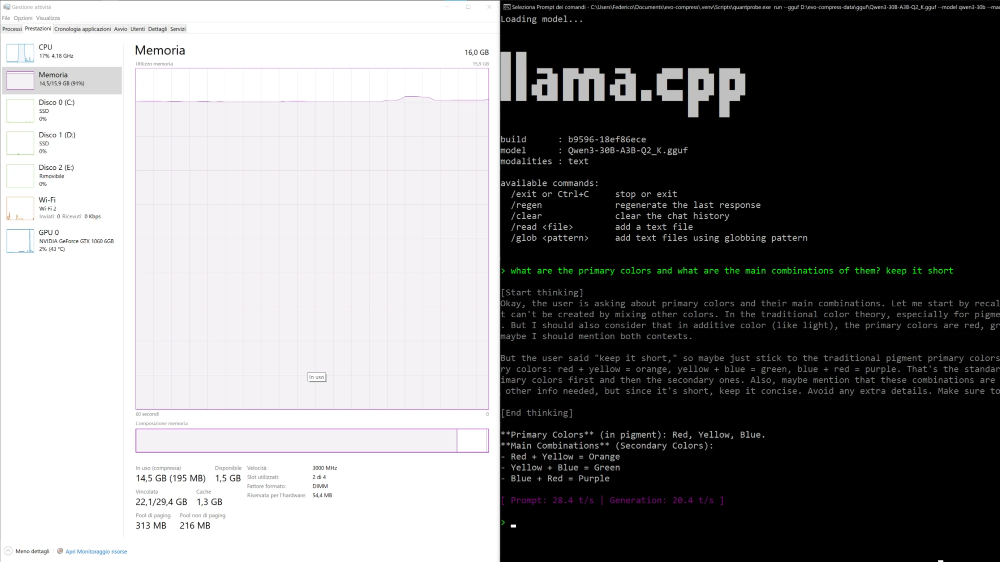

# quantprobe

Predicts how fast an LLM will run on your machine — **before you download it** — then hands you the exact llama.cpp command. If nothing fits well enough, it builds a quantization tuned to your specific model and hardware.

[**Quickstart**](#quickstart) · [**Browser version**](https://federicots.github.io/quantprobe/) · [**Commands**](#commands) · [**The laws**](LAWS.md) · [**When it won't help**](#when-quantprobe-wont-help-you)

    [](https://x.com/federico_sciuca)

## Quickstart

```bash
pip install quantprobe
quantprobe plan --model qwen3-30b
```

```
[quantprobe] no hardware flags: auto-detected this machine (vram 6GB@192 | ram 16GB@48 | disk 0.5 GB/s).
[quantprobe] calibration applied [ram 24.3 GB/s measured; disk 3.13 GB/s measured] (2026-07-28)
[quantprobe] anchored: CPU x1.18, GPU x0.75 from your calibrate anchor runs [tier ratios; --no-anchors disables]

quantprobe plan - Qwen3-30B-A3B @ 2.5-bit on THIS machine [auto-detected]
  model 10.6 GB | active 1.53 GB/token | est. quality cost x1.07 (depth-aware recipe)

  *   22.2 tok/s  split experts: 34%->VRAM, rest->RAM   [pins 7GB of 12GB RAM (CUDA host memory) - …]
      19.0 tok/s  hybrid: attention->VRAM, experts->RAM   [pins 10GB of 12GB RAM (CUDA host memory) - …]
      13.2 tok/s  pure CPU (GPU idle)   [RAM boundary - expect bimodal speed]

  speculation: pays ONLY when output copies its context (edits, refactors, RAG quoting)
  - on novel generation the ngram drafter produces 0 drafts and changes nothing (D-10,
  independently replicated on an RTX 3090). Details below.

  run it:  llama-server -m model.gguf -ngl 99 -ot "blk\.(16|17|…|47)\.ffn_.*_exps\.=CPU" --no-mmap -b 1024 -ub 1024 --threads 4
```

The first line is what a fresh install prints. The `calibration applied` and `anchored:` lines appear after you run `quantprobe calibrate` once — measured constants and your own anchor runs, not spec sheets.

**Downloads nothing. Takes a second.** No hardware flags needed — it reads your machine. `--model` and `--bits` just say what you're considering; point it at a file you already have with `--gguf model.gguf` instead.

Want it to do the whole thing for you?

```bash
quantprobe auto
```

Detects your machine, asks which model you want, picks the best quant for it, downloads it, and launches. No flags to learn.

## What it does

- **Predicts tok/s before you download** — across every placement (all-VRAM, hybrid, expert-split, CPU, disk-stream) and picks the winner.
- **Anchors predictions to *your* machine** — run `quantprobe calibrate` once and two benchmark runs on your own GGUF scale every prediction. That path passed the gate it pre-registered before any number existed (prereg #64): leave-one-out median error **19% → 5.8%** across 5 arms; ~12% median on the full ladder, misses erring low. `--no-anchors` restores the plain law.
- **Emits the exact command**, including the `-ot` regex most guides get wrong.
- **Finds free speed in what you already have** — [partial expert offload](#free-speed-you-probably-already-have) and [prompt-lookup speculation](#free-speed-part-two-if-you-write-code) need no new download.
- **Measures which layers of *your* model break** under compression, then builds a quant that protects them.
- **Tells you when to stop** — it declines the expensive path on machines that don't need it.
- Runs on stock [llama.cpp](https://github.com/ggml-org/llama.cpp). No custom runtime, nothing to build.

## Fast vs Custom

| | **Fast** — `quantprobe auto qwen3-30b` | **Custom** — `quantprobe auto qwen3-30b --custom` |
|---|---|---|
| what it does | picks the best existing quant for *your* machine, downloads it | measures which layers of *your* model break under compression, then builds a version tailored to it |
| time | minutes (mostly download) | **~50 min for a 7B, ~10 h for a 35B** — it tells you before starting |
| disk | one file | source + working files, 3–4× bigger |
| **speed** | full | **identical** — speed comes from placement, not from the build |
| **quality** | whatever the community published | **−9% perplexity at the same file size** |

**Most people want Fast.** Above ~3 bits per weight, community quants are already near-lossless — so `--custom` refuses to run on machines that don't need it and says why. Reach for Custom when you're squeezing a model that barely fits (under ~3 bits, where ordinary compression falls off a cliff), when you have a fine-tune nobody has published, or when you need maximum quality at a fixed size.

## Free speed you probably already have

Most guides put *all* of a mixture-of-experts model's experts in system RAM and leave your graphics card half empty. Keeping the first N expert layers on the GPU instead — same file, different flags:

| | all experts → RAM | **partial offload** |
|---|---|---|
| generation | 18.35 tok/s | **20.62 tok/s** (+12.4%) |
| prompt reading | 88 tok/s | **~238 tok/s** (2–3×) |

`plan` and `run` compute the cutoff from your *free* VRAM and emit the flags.

## Free speed, part two: if you write code

`--spec-type ngram-simple` drafts tokens by finding repeated spans in your own context, then verifies them — output is **identical**, it's one flag, nothing is downloaded.

| workload | off | ngram on | effect |
|---|---|---|---|
| **code** (edit a file, answer restates its input) | 17.72 | **37.17** | **2.10× — decode doubles** |
| prose (open-ended continuation) | 18.46 | 18.56 | 1.01× — nothing |
| code, but **MoE with *all* experts in RAM** | 18.18 | 18.81 | 1.03× — the union tax eats it |

Copyability is the whole mechanism: code answers repeat their input, prose invents. The 1.03× row is the *full* expert-offload arm only — on the expert-split placement the quickstart recommends, **tuned** ngram (`--spec-ngram-simple-size-m 384 --spec-ngram-simple-size-n 4`) measured **4.7×** decode at ~3-bit (21.3 → 98.8 tok/s), shrinking with bit-width (3.4× at Q3_K_M) because the verify round is compute-bound (V-04; preregs #28/#36/#37/#40). Turn it on whenever your output copies its context, on any placement except full expert-offload; on novel generation it drafts nothing and changes nothing.

## Measured results

| result | number |
|---|---|
| Qwen3-30B-A3B on a 2016 desktop | **20.4–22.2 tok/s** (healthy-clocks retest, preregs #60/#61) |
| Same model, partial expert offload | **20.62 tok/s** (+12.4%, free) |
| Same bytes, different layers protected (Gemma 4 12B) | **byte-identical files, 2.25 ppl apart** |
| Gemma 4 12B depth-aware 2-bit | 1.91× → **1.45×** quality cost, ~4.5 GB resident |
| GLM-4.5-Air **110B** from a SATA drive, 16 GB RAM | **0.19 tok/s** (capacity demo, not usable inference) |
| RAM overclock (XMP, 2133→3000) | dense **+52%** |

<p align="center"></p>
<p align="center"><em>One frame, no cuts: Qwen3-30B-A3B at <b>20.4 tok/s</b> on a 2016 desktop — GTX 1060 6 GB · 16 GB DDR4 · SATA SSD. Raw logs + GGUF SHA256: <a href="weights/data/validation_19tok/EVIDENCE.txt">EVIDENCE.txt</a>.</em></p>

**Every number above was written down as a prediction, published, and only then measured** — including the ones that missed. [All predictions and their verdicts →](preregistrations/) · [the four laws behind them →](LAWS.md)

## When quantprobe won't help you

- **Your model already fits comfortably in VRAM at 4 bits or more.** Community quants are near-lossless there, and — measured — quantizing further buys almost no speed once a model is resident: the same 7B at Q2_K vs Q4_K_M is 36% smaller and **4% slower**. Quantize to make a model *fit*; once it fits, stop. One lever remains inside a fit: on pre-Ampere cards the *format* sets decode speed — Q4_0 measured **+19%** end-to-end over Q4_K_M (26.87 vs 22.72 tok/s, preregs #52/#53), and Q2_K was slower than Q4_0 while 32% smaller. Speed-only (Q4_K_M is higher quality per byte), one card measured, unverified on Ampere+ — `plan` prints it whenever the all-in-VRAM row wins at ≤5.0 bits.
- **You want a tight number for a model that fits entirely in VRAM — and you haven't run `calibrate`.** This was the placement the law knew least well, and the ±25% band above does **not** apply to it. Since v1.20.1 there is a real answer: `quantprobe calibrate`'s all-in-VRAM anchor run plus per-format GPU efficiency (the L-16 format ladder) gives a **point prediction** for GPU-resident models — ~12% median error across the full ladder, misses erring low, and the anchor's own arm exact by construction ([MACHINE_LADDER.md](MACHINE_LADDER.md)). Uncalibrated, what we can state is **one-sided and exception-free**: across 8 models and 13 benchmarks, real speed was **≥ 0.90× the printed number every single time**, and in 12 of the 13 it was strictly higher — typically 1.1×–1.8×. That is a falsifiable claim with the same logical form as our ±25% band, just asymmetric: one measurement below 0.90× kills it. We have refuted six candidate explanations for the gap, including our own favourites: it is not fixed overhead, not GPU clock state, not bytes-per-token, not monotone in bit-width, not a per-format constant, and not a bytes-weighted mixture of the actual tensor types. Within a single architecture it moves cleanly with the dominant tensor type; across architectures it does not transfer. We would rather publish that than move a constant on thin evidence. **This is the single most useful thing you can send us:** `quantprobe bench --contribute` on a GPU-resident model turns your machine into the datapoint that fixes it.
- **You need task-level eval scores** (MMLU, HellaSwag). quantprobe measures perplexity and KL divergence only.
- **Your architecture isn't in the fragility atlas** (four families so far). The probe still works on your model; the published priors just won't apply. *Open an issue with your result — those are the most valuable datapoints.*
- **You want multi-token prediction modeled in the planner.** It isn't. Measured, the effect runs from **+17% (dense, GPU-resident) to −24% (MoE, experts in RAM)** — there's no single multiplier to apply. [Full 2×2 →](preregistrations/2026-07-24-law6-speculation-economics.md)
- **You're on a Mac or a 50-series card.** Those presets are extrapolated, not measured. `quantprobe bench --contribute` turns one into a datapoint.
- **You need throughput numbers.** Everything here is single-stream decode on one machine; expect ±25% across environments.

## Commands

```bash
quantprobe auto                                # interactive: detects, asks, decides, runs
quantprobe plan  --gguf model.gguf             # predicted tok/s + placement + launch command
quantprobe hw                                  # what the law sees on THIS machine
quantprobe calibrate                           # measure, don't assume: RAM stream, disk, GPU clocks; optional anchor runs
quantprobe run   --gguf model.gguf             # plan the placement, then launch chat
quantprobe bench --gguf model.gguf --contribute # predicted vs measured; opt-in datapoint
```

<details>
<summary>Six more: optimize, target, fetch, quantize, probe, dashboard</summary>

```bash
quantprobe optimize --tps 20                             # cheapest path to a speed target, Pareto-ranked
quantprobe target   --tps 5 --ladder                     # inverse: target -> smartest model that fits
quantprobe fetch    qwen3-30b ./models                   # robust, resumable download
quantprobe quantize --gguf f16.gguf --out 2bit.gguf      # build a depth-aware quant
quantprobe probe    --gguf f16.gguf --eval wiki.test.raw # measure YOUR model's fragile band
quantprobe dashboard --gguf 2bit.gguf                    # the law live, every reply scored vs prediction
```
</details>

`hw`/`plan`/`target`/`optimize` need nothing but Python. The weight-touching commands drive stock llama.cpp — point at it with `--llama-dir`, `QUANTPROBE_LLAMA_DIR`, or `PATH`, and preview anything with `--dry`. 17 machine presets ship in (`--machine`); multi-GPU and RAID aggregate with comma lists (`--vram 24,24`).

> **Windows: `'quantprobe' is not recognized`?** pip put it in a folder that isn't on your PATH. Use `python -m quantprobe ...` — identical, always works.

## Contributing

`quantprobe bench --contribute` prints exactly what would be shared plus a pre-filled issue link — **you review and submit; nothing is ever sent automatically.** Points that land *outside* the predicted bands are the most valuable ones, and there are [open predictions](preregistrations/) anyone can settle.

## Docs

| | |
|---|---|
| [QUICKSTART.md](QUICKSTART.md) | get running, three levels; recipes for fine-tunes, coding agents, hardware buying |
| [LAWS.md](LAWS.md) | the four laws — statements, measurements, falsifiable predictions |
| [docs/EXAMPLES.md](docs/EXAMPLES.md) | worked examples with real output, including the ×5.4 optimizer A/B |
| [docs/HARDWARE.md](docs/HARDWARE.md) | the 2016 box: exact specs, measured bandwidths, what the next euro buys |
| [preregistrations/](preregistrations/) | every staked prediction with its verdict — hits **and** misses |
| [MACHINE_LADDER.md](MACHINE_LADDER.md) | every model four ways — naive default / informed llama.cpp / quantprobe / staked prediction — including the v1.20.2 accuracy correction |
| [CONTRIBUTING.md](CONTRIBUTING.md) | the method: stake, measure, score *and wire*, audit |
| [docs/DEEP-DIVE.md](docs/DEEP-DIVE.md) | what's new vs. built-on, parity tables, and the repository map |
| [papers/arxiv/](papers/arxiv/) | the paper (submission-ready LaTeX) |
| [CHANGELOG.md](CHANGELOG.md) | every release, including corrections to numbers published here |

## Credits

[colibri](https://github.com/JustVugg/colibri) (744B on 25 GB, pure C) inspired the tier-streaming exploration. The quantization stack builds on [llama.cpp](https://github.com/ggml-org/llama.cpp) and the QTIP/QuIP# incoherence codecs — whose central tool our first law bounds. Independent research by Federico Sciuca, AI-supported, on one desktop.

Two community contributors changed the tool measurably: **u/RogerAI--fyi** (Reddit) observed that the Law 4 formulation omitted per-token KV reads — measured, confirmed, shipped within a day. **u/MoneroApe** pointed me at [apex-quant](https://github.com/localai-org/apex-quant) and TurboQuant, and testing against **mudler's APEX** exposed two real gaps in my recipe: unprotected always-active tensors (their kurtosis argument, adopted here) and no importance-matrix calibration at all. MoneroApe then ran the first external replication (RTX 3090 + a 117.6B MoE, register E-06): it exposed five real defects in the shipped tool — the 2× channel-count error, the ubatch cap, a missing pinned-memory warning, a missing `--threads`, the buried speculation note — all fixed in v1.19 with tests named after the report, and `quantprobe calibrate` exists because of it.

## License

MIT — see [LICENSE](LICENSE). © 2026 Federico Sciuca.
