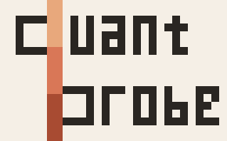
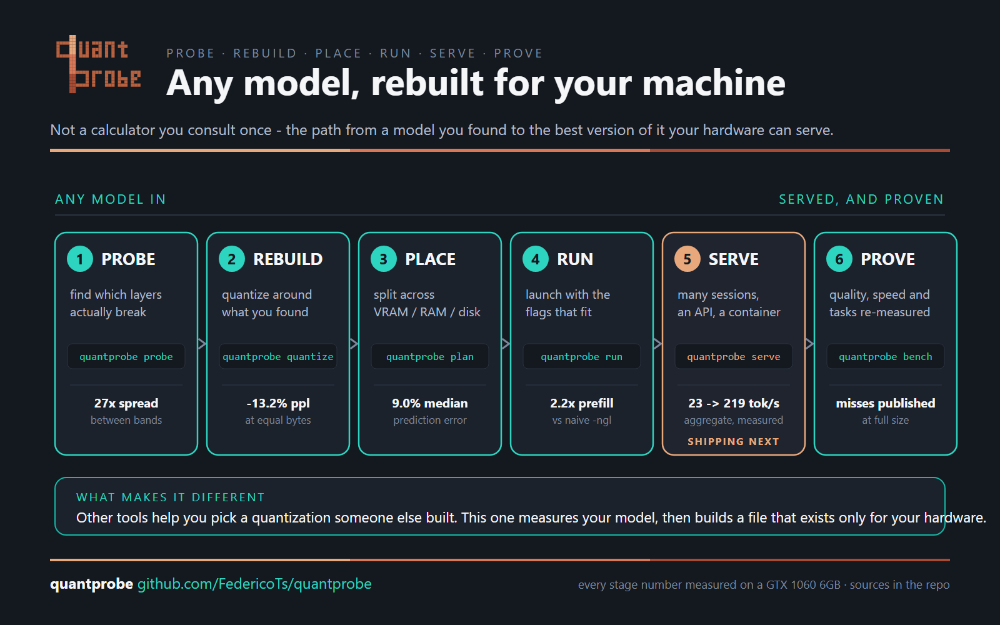
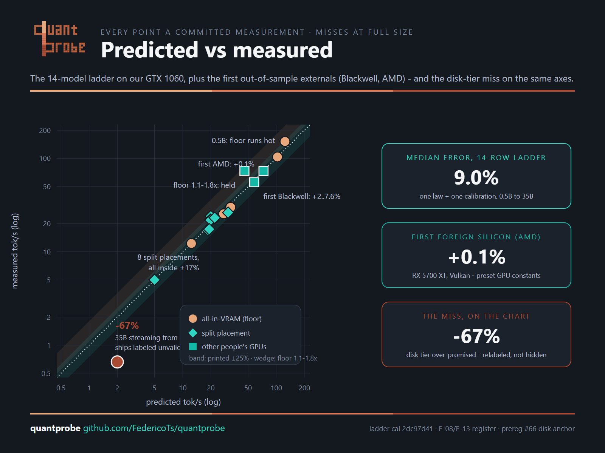
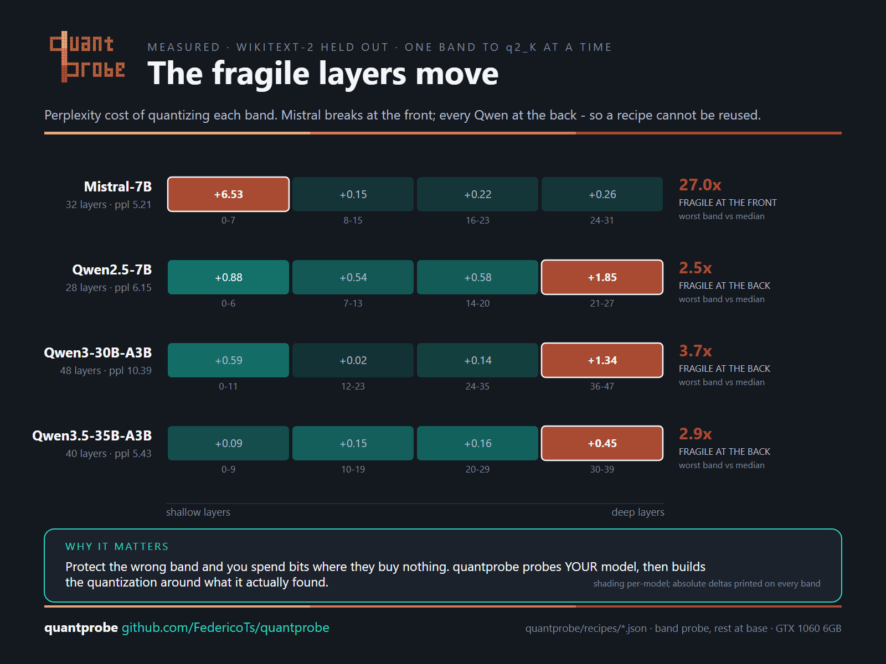
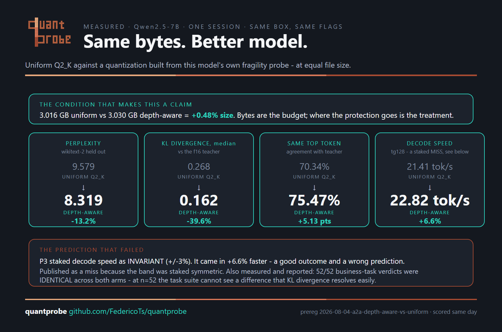
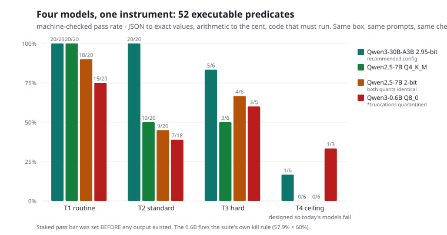
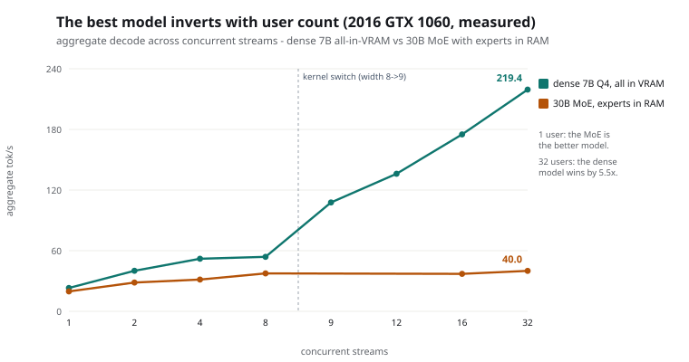
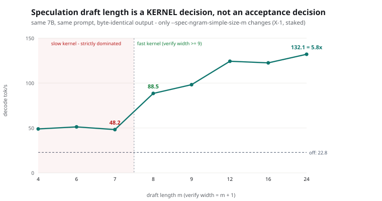

<p align="center">
  
</p>

# quantprobe

<p align="center"><em>the bar is the probe: one column through the memory tiers it prices — VRAM, RAM, disk.</em></p>

### Will this model run on my machine, and how fast?

**Answered in one second, before you download anything — then rebuilt so it runs better.**

<p align="center">
  
</p>

Most tools help you pick a quantization someone else built. This one **measures your model, then builds a file that exists only for your hardware** — it probes each layer to find where the model actually breaks, protects that band and crushes the rest, places the result across VRAM/RAM/disk, emits the exact llama.cpp command (or launches it for you with `quantprobe auto`), and then proves the result: speed re-measured on demand, quality scored by KL divergence, the config put through **40 machine-checked business tasks**, and every `bench --contribute` run feeding a public [validation atlas](docs/HARDWARE_TABLE.md). Because **every claim here was pre-registered before measurement, and the misses are published at the same size as the hits.**

[**Quickstart**](#quickstart) · [**Browser version**](https://federicots.github.io/quantprobe/) · [**What runs on what**](docs/MATRIX.md) · [**Commands**](#commands) · [**The laws**](LAWS.md) · [**When it won't help**](#when-quantprobe-wont-help-you)

    [](https://x.com/federico_sciuca)

**Validated, not vibes.** 14-model ladder at **8.4% median error** on measured hardware · every printed all-in-VRAM number a documented **floor** (real speed ≥0.90× on 13/13 benchmarks, typically 1.1–1.8× higher) · retrodicts third-party results it never trained on ([airllm's 30× spread, DGX Spark reports, a 1.56 TB Kimi rig](docs/MATRIX.md)) · **every prediction staked before measuring, and the misses published at the same size as the hits.**

<p align="center">
  
</p>

The miss is on the chart at the same size as the hits, because that is the only version of this plot worth trusting.

## Quickstart

```bash
pip install quantprobe
quantprobe plan --model qwen3-30b
```

```
[quantprobe] no hardware flags: auto-detected this machine (vram 6GB@192 | ram 16GB@48 | disk 0.5 GB/s).
[quantprobe] calibration applied [ram 24.3 GB/s measured; disk 3.13 GB/s measured] (2026-07-28)
[quantprobe] anchored: CPU x1.18, GPU x0.75 from your calibrate anchor runs [tier ratios; --no-anchors disables]

quantprobe plan - Qwen3-30B-A3B @ 2.5-bit on THIS machine [auto-detected]
  model 10.6 GB | active 1.53 GB/token | est. quality cost x1.07 (depth-aware recipe)

  *   22.2 tok/s  split experts: 34%->VRAM, rest->RAM   [pins 7GB of 12GB RAM (CUDA host memory) - …]
      19.0 tok/s  hybrid: attention->VRAM, experts->RAM   [pins 10GB of 12GB RAM (CUDA host memory) - …]
      13.2 tok/s  pure CPU (GPU idle)   [RAM boundary - expect bimodal speed]

  binding constraint: BANDWIDTH-BOUND (system RAM bandwidth) - 51% of every decode token is spent there.

  run it:  llama-server -m model.gguf -ngl 99 -ot "blk\.(16|17|…|47)\.ffn_.*_exps\.=CPU" --no-mmap -b 1024 -ub 1024 --threads 4
```

The first line is what a fresh install prints. The `calibration applied` and `anchored:` lines appear after you run `quantprobe calibrate` once — measured constants and your own anchor runs, not spec sheets. The **binding constraint** line is the part most tools never tell you: *3 tok/s, disk-bound* means buy RAM; *3 tok/s, bandwidth-bound* means don't bother.

**Downloads nothing. Takes a second.** No hardware flags needed — it reads your machine. `--model` and `--bits` just say what you're considering; point it at a file you already have with `--gguf model.gguf` instead.

Want it to do the whole thing for you?

```bash
quantprobe auto
```

Detects your machine, asks which model you want, picks the best quant for it, downloads it, and launches. No flags to learn.

## What it does

One pipeline, end to end — most tools ship the first line only:

- **Predicts tok/s before you download** — across every placement (all-VRAM, hybrid, expert-split, CPU, disk-stream) and picks the winner, printing **which resource binds** and what fixing it would buy.
- **Anchors predictions to *your* machine** — run `quantprobe calibrate` once and two benchmark runs on your own GGUF scale every prediction. That path passed the gate it pre-registered before any number existed (prereg #64): leave-one-out median error **19% → 5.8%** across 5 arms; ~12% median on the full ladder, misses erring low. `--no-anchors` restores the plain law.
- **Emits the exact command**, including the `-ot` regex most guides get wrong.
- **Finds free speed in what you already have** — [partial expert offload](#free-speed-you-probably-already-have) and [prompt-lookup speculation](#free-speed-part-two-if-you-write-code) need no new download.
- **Builds layer-aware quantizations** — measures which layers of *your* model break under compression, then protects them (−9% perplexity at the same file size). [Why a recipe cannot be reused ↓](#why-your-model-needs-its-own-recipe)
- **Audits a running Ollama install** — `quantprobe audit-ollama` reads the placement Ollama actually chose, prices it against the planner's, and refuses to compare while VRAM is contended (a measurement discipline most benchmarks skip).
- **Proves quality, not just speed** — perplexity *and* full-distribution KL divergence via llama.cpp's own `--kl-divergence`, because we measured perplexity moving 23% while the model changed its chosen token on 27% of positions.
- **Tells you when to stop** — it declines the expensive path on machines that don't need it.
- Runs on stock [llama.cpp](https://github.com/ggml-org/llama.cpp). No custom runtime, nothing to build.

## Why your model needs its own recipe

<p align="center">
  
</p>

The fragile layers **move between models**. Mistral-7B breaks at the *front* — its first eight layers cost **27× more** perplexity than its median band — while Qwen2.5-7B, Qwen3-30B and Qwen3.5-35B all break at the *back*. Architecture family does not predict it; weight statistics point the wrong way. Protect the wrong band and you spend bits where they buy nothing, which is why `quantprobe probe` measures **your** model before `quantprobe quantize` builds anything. Raw bands: [`quantprobe/recipes/`](quantprobe/recipes/).

And the payoff, at **equal file size** (+0.48%, inside the staked ±2% gate):

<p align="center">
  
</p>

Bytes are the budget; *where the protection goes* is the treatment. The speed panel carries a **staked miss** — we predicted decode would be unchanged (±3%) and it came in +6.6% faster, which is a good outcome and a failed prediction, published at the same size as the wins. Full stake and verdict: [prereg 2026-08-04](preregistrations/2026-08-04-a2a-depth-aware-vs-uniform.md).

## Does the cheap quant actually do the work?

Speed numbers are worthless if the model can't do the job. So we staked a bar **before generating a single output** — ≥80% of machine-checked tasks or the config is business-useful; under 60% and every tok/s figure we publish gets qualified — and ran the recommended 2.5-bit 30B through **40 auto-scored business tasks**: JSON extraction with exact values, arithmetic to the cent, single-label classification, code that must execute and pass assertions, summaries where **any number not present in the source fails a deterministic hallucination check**.

**Result: 40/40.** Five tasks initially exhausted a 4k context window mid-reasoning; at 16k all five pass (one needed 7,417 tokens of thinking — reasoning models spend their budget before they answer). Honest floor if you count those five as failures anyway: 85%, still above the staked bar. [Full outputs, every check, every verdict →](weights/data/bt_20260803_2228_qwen30b_q2k.json)

The task set also carries a **difficulty ladder** for comparing models on identical predicates — up to a tier designed so today's models fail it:

| model (same 52 predicates, same box) | staked 40 | T3 hard | T4 ceiling |
|---|---|---|---|
| **Qwen3-30B-A3B @ 2.95-bit** (the recommended config) | **40/40** | 5/6 | 1/6 |
| Qwen2.5-7B @ Q4_K_M | 30/40 | 3/6 | 0/6 |
| Qwen2.5-7B @ 2-bit (both quants, byte-equal) | 27/40 | 4/6 | 0/6 |
| Qwen3-0.6B @ Q8 | 22/38* | 3/5* | 1/3* |

<p align="center"></p>

\* thinking-model truncations quarantined and disclosed, never counted as failures. The 0.6B
fires the suite's own kill rule (57.9% < 60%) — the instrument correctly refuses to call it
business-usable. And one honest anomaly the ladder itself exposed: **the only T4 task anyone
solved (the 5-house logic puzzle) was solved by the *biggest and the smallest* model while both
7Bs failed it** — non-monotonic in capability, the signature of training-data recall rather
than reasoning. That task is being replaced with a generated-novel variant; the score stands as
recorded.

Every T3/T4 answer key is recomputed mechanically by the self-test and both logic puzzles are brute-forced to exactly one solution before any model is scored. The T4 nine-digit multiplication is the tier working as intended: the model *announced it would need a calculator*, then printed a confident 18-digit answer that is wrong at digit 5.

## Check any speed claim without owning the hardware

Law 4 is `tok/s = η·BW ÷ bytes-per-token`, and it prices other people's machines as well as yours ([the full hardware × model matrix →](docs/MATRIX.md)):

- **"DGX Spark runs 70B Q4 at 35–45 tok/s"** — a 70B dense at Q4 moves 42.5 GB per token; at 273 GB/s the *perfect-efficiency* ceiling is 6.4 tok/s. The claim needs 5.5–7× the bandwidth the hardware has. Whatever was measured, it wasn't single-stream decode.
- **A 1.56 TB Kimi K3 rig reported as "10 tok/s"** — the repo's own README says *seconds per token*; the relay inverted the unit by 200–320×. Better: its four RAM presets test the law. "Add RAM" predicts 15.6× speedup; Law 4 predicts almost none (the expert working set can't be cached); measured across the presets: **1.63×**.
- **airllm's unexplained 30× spread** (0.07–2 tok/s across hosts) — the law retrodicts it as a tier boundary: RAM-resident hosts land on the RAM term, disk-bound hosts on the disk term.

Same arithmetic the planner runs — you just feed it someone else's bandwidth and bytes.

## One box, two right answers — it depends how many people are using it

<p align="center"></p>

At **one user** the 30B MoE is the better model — smarter, and 19.7 tok/s. At **32 users** the
dense 7B wins by 5.5× on aggregate throughput, because routed-expert reads from system RAM do
not amortise across streams while dense weights read once serve everyone. The jump at width
8→9 is a kernel switch, not a smooth curve — which also makes batch widths 2–8 strictly
dominated on this card class. `plan` prints the right advice for whichever placement it
recommends (U-38 overturned our own prior "2× ceiling"; U-39 confirmed the MoE cap as staked).

## Fast vs Custom

| | **Fast** — `quantprobe auto qwen3-30b` | **Custom** — `quantprobe auto qwen3-30b --custom` |
|---|---|---|
| what it does | picks the best existing quant for *your* machine, downloads it | measures which layers of *your* model break under compression, then builds a version tailored to it |
| time | minutes (mostly download) | **~50 min for a 7B, ~10 h for a 35B** — it tells you before starting |
| disk | one file | source + working files, 3–4× bigger |
| **speed** | full | **identical** — speed comes from placement, not from the build |
| **quality** | whatever the community published | **−9% ppl** (Gemma-12B) · **−13.2% ppl / −39.5% KLD** (Qwen2.5-7B, byte-matched, [staked](preregistrations/2026-08-04-a2a-depth-aware-vs-uniform.md)) |

**Most people want Fast.** Above ~3 bits per weight, community quants are already near-lossless — so `--custom` refuses to run on machines that don't need it and says why. Reach for Custom when you're squeezing a model that barely fits (under ~3 bits, where ordinary compression falls off a cliff), when you have a fine-tune nobody has published, or when you need maximum quality at a fixed size.

## Free speed you probably already have

Most guides put *all* of a mixture-of-experts model's experts in system RAM and leave your graphics card half empty. Keeping the first N expert layers on the GPU instead — same file, different flags:

| | all experts → RAM | **partial offload** |
|---|---|---|
| generation | 18.35 tok/s | **20.62 tok/s** (+12.4%) |
| prompt reading | 88 tok/s | **~238 tok/s** (2–3×) |

`plan` and `run` compute the cutoff from your *free* VRAM and emit the flags.

## Free speed, part two: if you write code

`--spec-type ngram-simple` drafts tokens by finding repeated spans in your own context, then verifies them — output is **identical**, it's one flag, nothing is downloaded.

<p align="center"></p>

**Draft length is the lever, and it is a kernel decision.** Drafts of 4–7 verify in llama.cpp's
slow mat-vec path; m≥8 crosses into the fast one. Measured on the same model, same prompt,
byte-identical output: 48.2 → **88.5** in one step, up to **132.1 tok/s (5.8×)** at m=24.

| workload | off | ngram on | effect |
|---|---|---|---|
| **code** (edit a file, answer restates its input) | 17.72 | **37.17** | **2.10× — decode doubles** |
| prose (open-ended continuation) | 18.46 | 18.56 | 1.01× — nothing |
| code, but **MoE with *all* experts in RAM** | 18.18 | 18.81 | 1.03× — the union tax eats it |

Copyability is the whole mechanism: code answers repeat their input, prose invents. The 1.03× row is the *full* expert-offload arm only — on the expert-split placement the quickstart recommends, **tuned** ngram (`--spec-ngram-simple-size-m 384 --spec-ngram-simple-size-n 4`) measured **4.7×** decode at ~3-bit (21.3 → 98.8 tok/s), shrinking with bit-width (3.4× at Q3_K_M) because the verify round is compute-bound (V-04; preregs #28/#36/#37/#40). Turn it on whenever your output copies its context, on any placement except full expert-offload; on novel generation it drafts nothing and changes nothing.

## Measured results

| result | number |
|---|---|
| Qwen3-30B-A3B on a 2016 desktop | **20.4–22.7 tok/s** (22.69 re-measured 2026-08-03 on a normal working session, [server log](weights/data/bt_server.log); 22.94 on a scrubbed box, not quoted as the headline) |
| Same config, 40 machine-checked business tasks | **40/40** ([evidence](weights/data/bt_20260803_2228_qwen30b_q2k.json)) |
| Same model, partial expert offload | **20.62 tok/s** (+12.4%, free) |
| Depth-aware vs uniform quant, **equal bytes** (7B @ 2-bit, staked A2A) | **-13.2% perplexity, -39.5% median KLD, +5.1 pts same-token, +6.6% tok/s** at +0.48% file size ([prereg + verdict](preregistrations/2026-08-04-a2a-depth-aware-vs-uniform.md)) |
| Context window trade, measured | 22.69 tok/s at 4k ctx → **~11.7 at 16k** — KV displaces weights on a 6 GB card; run 4k for chat, open it for long chains |
| Same bytes, different layers protected (Gemma 4 12B) | **byte-identical files, 2.25 ppl apart** |
| Gemma 4 12B depth-aware 2-bit | 1.91× → **1.45×** quality cost, ~4.5 GB resident |
| GLM-4.5-Air **110B** from a SATA drive, 16 GB RAM | **0.19 tok/s** (capacity demo, not usable inference) |
| RAM overclock (XMP, 2133→3000) | dense **+52%** |
| 14-row ladder, median absolute error | **8.4%** (2026-08-01, clean conditions) |
| Disk-tier row, 117B MoE streamed from SATA | predicted 0.332, **measured 0.476 tok/s — we were 30% pessimistic** |

<details>
<summary><b>What "clean conditions" means, and why we say it</b></summary>

The 8.4% ladder above was measured on a **deliberately quiesced machine**: no browser, no coding
agent, background services stopped, verified by gate before each phase at **CPU 0.7% mean / 2.0%
max** with 14.1 GB RAM free. One `cal_id` throughout, benches strictly serial.

That is not your machine on a normal day, and we will not pretend otherwise:

- **All 14 rows measured faster than the previous pass** — not 13, all of them. Median **+4.6%**,
  up to +27.5%. The scrubbed box is a **ceiling**, not a typical result.
- Because of that, **the published headline speeds above stay conservative.** Qwen3-30B-A3B measured
  **22.94 tok/s** on the scrubbed pass; the headline quotes 22.69, measured with a coding agent and
  desktop apps live, because a number you can only get by stopping services is not a number you can
  reproduce.
- The median moved 9.0% → 8.4%, which is **inside our own ±1 point noise floor**, so we report it
  as *unchanged* rather than improved — even though the smaller number is the flattering one.
- An earlier version of this section called the gemma4-12B row "untrustworthy" on a 27% spread.
  **That claim was retracted**: it compared runs across different machine states, violating our own
  C-14 rule. Measured properly — six consecutive same-state runs — the spread is **1.087×**
  (12.17–13.23 tok/s), and the query is scripted so anyone can reproduce it.

The disk-tier row is the first disk-tier measurement this project has ever taken, and **it failed
its own staked band.** We publish it at the same size as the wins. Details, including the two
mechanisms we tested and the one that survived: [CHANGELOG](CHANGELOG.md).

</details>

<p align="center"></p>
<p align="center"><em>One frame, no cuts: Qwen3-30B-A3B at <b>20.4 tok/s</b> on a 2016 desktop — GTX 1060 6 GB · 16 GB DDR4 · SATA SSD. Raw logs + GGUF SHA256: <a href="weights/data/validation_19tok/EVIDENCE.txt">EVIDENCE.txt</a>.</em></p>

**Every number above was written down as a prediction, published, and only then measured** — including the ones that missed. [All predictions and their verdicts →](preregistrations/) · [the four laws behind them →](LAWS.md)

## When quantprobe won't help you

- **Your model already fits comfortably in VRAM at 4 bits or more.** Community quants are near-lossless there, and — measured — quantizing further buys almost no speed once a model is resident: the same 7B at Q2_K vs Q4_K_M is 36% smaller and **4% slower**. Quantize to make a model *fit*; once it fits, stop. One lever remains inside a fit: on pre-Ampere cards the *format* sets decode speed — Q4_0 measured **+19%** end-to-end over Q4_K_M (26.87 vs 22.72 tok/s, preregs #52/#53), and Q2_K was slower than Q4_0 while 32% smaller. Speed-only (Q4_K_M is higher quality per byte), one card measured, unverified on Ampere+ — `plan` prints it whenever the all-in-VRAM row wins at ≤5.0 bits.
- **You want a tight number for a model that fits entirely in VRAM — and you haven't run `calibrate`.** This was the placement the law knew least well, and the ±25% band above does **not** apply to it. Since v1.20.1 there is a real answer: `quantprobe calibrate`'s all-in-VRAM anchor run plus per-format GPU efficiency (the L-16 format ladder) gives a **point prediction** for GPU-resident models — ~12% median error across the full ladder, misses erring low, and the anchor's own arm exact by construction ([MACHINE_LADDER.md](MACHINE_LADDER.md)). Uncalibrated, what we can state is **one-sided and exception-free**: across 8 models and 13 benchmarks, real speed was **≥ 0.90× the printed number every single time**, and in 12 of the 13 it was strictly higher — typically 1.1×–1.8×. That is a falsifiable claim with the same logical form as our ±25% band, just asymmetric: one measurement below 0.90× kills it. We have refuted six candidate explanations for the gap, including our own favourites: it is not fixed overhead, not GPU clock state, not bytes-per-token, not monotone in bit-width, not a per-format constant, and not a bytes-weighted mixture of the actual tensor types. Within a single architecture it moves cleanly with the dominant tensor type; across architectures it does not transfer. We would rather publish that than move a constant on thin evidence. **This is the single most useful thing you can send us:** `quantprobe bench --contribute` on a GPU-resident model turns your machine into the datapoint that fixes it. One Spark row is already logged against us: Gemma-4-26B reports 0.77× our floor — unexplained, published, next in the queue.
- **You need task-level eval scores** (MMLU, HellaSwag). quantprobe measures perplexity, KL divergence, and its own [40-task business suite](weights/business_tasks.py) — not academic benchmarks.
- **Your architecture isn't in the fragility atlas** (four families so far). The probe still works on your model; the published priors just won't apply. *Open an issue with your result — those are the most valuable datapoints.*
- **You want multi-token prediction modeled in the planner.** It isn't. Measured, the effect runs from **+17% (dense, GPU-resident) to −24% (MoE, experts in RAM)** — there's no single multiplier to apply. [Full 2×2 →](preregistrations/2026-07-24-law6-speculation-economics.md)
- **You're on a Mac or a 50-series card.** Those presets are extrapolated, not measured. `quantprobe bench --contribute` turns one into a datapoint.
- **You need throughput numbers.** Everything here is single-stream decode on one machine; expect ±25% across environments.

## Commands

```bash
quantprobe auto                                # interactive: detects, asks, decides, runs
quantprobe plan  --gguf model.gguf             # predicted tok/s + placement + launch command
quantprobe hw                                  # what the law sees on THIS machine
quantprobe calibrate                           # measure, don't assume: RAM stream, disk, GPU clocks; optional anchor runs
quantprobe run   --gguf model.gguf             # plan the placement, then launch chat
quantprobe audit-ollama                        # what is Ollama's default costing you? measured, contention-guarded
quantprobe bench --gguf model.gguf --contribute # predicted vs measured; opt-in datapoint
```

<details>
<summary>Six more: optimize, target, fetch, quantize, probe, dashboard</summary>

```bash
quantprobe optimize --tps 20                             # cheapest path to a speed target, Pareto-ranked
quantprobe target   --tps 5 --ladder                     # inverse: target -> smartest model that fits
quantprobe fetch    qwen3-30b ./models                   # robust, resumable download
quantprobe quantize --gguf f16.gguf --out 2bit.gguf      # build a depth-aware quant
quantprobe probe    --gguf f16.gguf --eval wiki.test.raw # measure YOUR model's fragile band
quantprobe dashboard --gguf 2bit.gguf                    # the law live, every reply scored vs prediction
```
</details>

`hw`/`plan`/`target`/`optimize` need nothing but Python. The weight-touching commands drive stock llama.cpp — point at it with `--llama-dir`, `QUANTPROBE_LLAMA_DIR`, or `PATH`, and preview anything with `--dry`. 17 machine presets ship in (`--machine`); multi-GPU and RAID aggregate with comma lists (`--vram 24,24`).

> **Windows: `'quantprobe' is not recognized`?** pip put it in a folder that isn't on your PATH. Use `python -m quantprobe ...` — identical, always works.

## Contributing

`quantprobe bench --contribute` prints exactly what would be shared plus a pre-filled issue link — **you review and submit; nothing is ever sent automatically.** Points that land *outside* the predicted bands are the most valuable ones, and there are [open predictions](preregistrations/) anyone can settle.

## Docs

| | |
|---|---|
| [QUICKSTART.md](QUICKSTART.md) | get running, three levels; recipes for fine-tunes, coding agents, hardware buying |
| [LAWS.md](LAWS.md) | the four laws — statements, measurements, falsifiable predictions |
| [docs/MATRIX.md](docs/MATRIX.md) | **what to run on what** — 11 machines × 11 models, every cell priced by the shipped engine, scored against third-party reports |
| [docs/ATLAS.md](docs/ATLAS.md) | **every machine the law has been scored on** — and the one command that adds yours |
| [docs/EXAMPLES.md](docs/EXAMPLES.md) | worked examples with real output, including the ×5.4 optimizer A/B |
| [docs/HARDWARE.md](docs/HARDWARE.md) | the 2016 box: exact specs, measured bandwidths, what the next euro buys |
| [docs/HARDWARE_TABLE.md](docs/HARDWARE_TABLE.md) | every GPU the tool can name, with its validation status: measured / external / spec-only |
| [preregistrations/](preregistrations/) | every staked prediction with its verdict — hits **and** misses |
| [MACHINE_LADDER.md](MACHINE_LADDER.md) | every model four ways — naive default / informed llama.cpp / quantprobe / staked prediction — including the v1.20.2 accuracy correction |
| [weights/business_tasks.py](weights/business_tasks.py) | the 52-task suite: 40 staked + T3/T4 ladder, every check executable, self-testing |
| [CONTRIBUTING.md](CONTRIBUTING.md) | the method: stake, measure, score *and wire*, audit |
| [docs/DEEP-DIVE.md](docs/DEEP-DIVE.md) | what's new vs. built-on, parity tables, and the repository map |
| [docs/QUANT_QUALITY.md](docs/QUANT_QUALITY.md) | **does the recipe preserve capability, not just perplexity?** — naive vs recipe vs original on MATH-500/GSM8K/IFEval; the size-dependence law; fragility survives hybrid linear attention |
| [papers/arxiv/](papers/arxiv/) | the paper (submission-ready LaTeX) |
| [CHANGELOG.md](CHANGELOG.md) | every release, including corrections to numbers published here |

## Credits

[colibri](https://github.com/JustVugg/colibri) (744B on 25 GB, pure C) inspired the tier-streaming exploration. The quantization stack builds on [llama.cpp](https://github.com/ggml-org/llama.cpp) and the QTIP/QuIP# incoherence codecs — whose central tool our first law bounds. Independent research by Federico Sciuca, AI-supported, on one desktop.

**[bigattichouse](https://github.com/bigattichouse)** builds [llama-optimize](https://github.com/bigattichouse/llama-optimize) and [robust](https://github.com/bigattichouse/robust) — llama.cpp flag tuning by Design of Experiments, on a general Morris/Sobol/Taguchi toolkit written in C and released to the public domain. Two things came from reading them (register E-16, prereg #95): independent convergence on machine-state hygiene — their runner settles GPU temperature between runs and records it, which is the same conclusion our stuck-boost result reached the hard way — and a method we did not have. Morris screening ranks which knobs actually matter and flags which interact; Sobol variance attribution will check our binding-constraint classifier against measured variance for the first time. Their tool searches because it knows nothing about the machine in advance; ours predicts. The two compose.

Two community contributors changed the tool measurably: **u/RogerAI--fyi** (Reddit) observed that the Law 4 formulation omitted per-token KV reads — measured, confirmed, shipped within a day. **u/MoneroApe** pointed me at [apex-quant](https://github.com/localai-org/apex-quant) and TurboQuant, and testing against **mudler's APEX** exposed two real gaps in my recipe: unprotected always-active tensors (their kurtosis argument, adopted here) and no importance-matrix calibration at all. MoneroApe then ran the first external replication (RTX 3090 + a 117.6B MoE, register E-06): it exposed five real defects in the shipped tool — the 2× channel-count error, the ubatch cap, a missing pinned-memory warning, a missing `--threads`, the buried speculation note — all fixed in v1.19 with tests named after the report, and `quantprobe calibrate` exists because of it.

## License

MIT — see [LICENSE](LICENSE). © 2026 Federico Sciuca.
