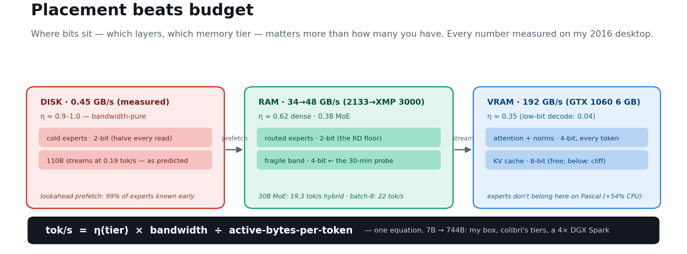
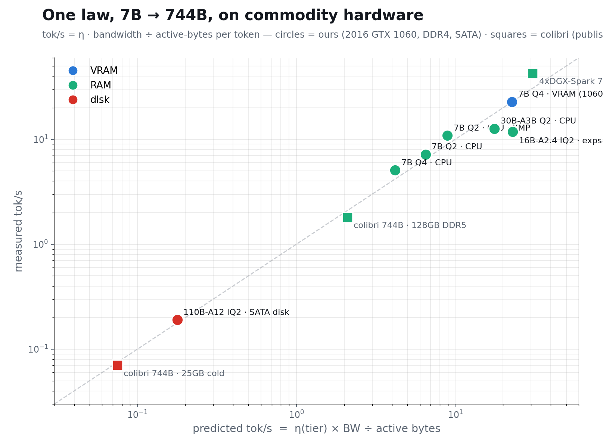

# quantprobe

### How fast will this model run on *my* machine — and how do I make it faster?

**Answers both before you download anything. Then hands you the exact command.** Every number measured on one 2016 desktop (GTX 1060 6 GB · 16 GB DDR4 · SATA SSD), and every claim published as a prediction *made before the measurement*.

    [](https://x.com/federico_sciuca)

<p align="center"></p>

---

## Start here

```bash
pip install quantprobe
quantprobe auto
```

That's it — it detects your machine, asks which model you want, and gets you running. No flags to learn.

**Just want the number first?** `quantprobe plan --gguf model.gguf` prints your predicted tok/s, whether it fits, and the launch command. Downloads nothing, takes a second. There's also a [browser version](https://federicots.github.io/quantprobe/) with nothing to install.

## The two ways to run a model

| | **Fast** — `quantprobe auto qwen3-30b` | **Custom** — `quantprobe auto qwen3-30b --custom` |
|---|---|---|
| what it does | picks the best existing quant for *your* machine, downloads it | measures which layers of *your* model break under compression, then builds a version tailored to it |
| time | minutes (mostly download) | **~50 min for a 7B, ~10 h for a 35B** — it tells you before starting |
| disk | one file | source + working files, 3–4× bigger |
| **speed** | full | **identical** — speed comes from placement, not from the build |
| **quality** | whatever the community published | **−9% perplexity at the same file size** ([measured](preregistrations/2026-07-25-recipe-upgrade-shexp-imatrix.md)) |

**Most people want Fast.** Above ~3 bits per weight, community quants are already near-lossless — so `--custom` *refuses to run* on machines that don't need it and explains why. The tool declines to sell you its own product.

**Use Custom when** you're squeezing a model that barely fits (under ~3 bits, where ordinary compression falls off a cliff), you have your own fine-tune nobody has published, or you need maximum quality at a fixed size.

## The free speed you probably already have

Most guides put *all* of a mixture-of-experts model's experts in system RAM and leave your graphics card half empty. Keeping the first N expert layers on the GPU instead — same file, different flags — measured on the reference box:

| | all experts → RAM | **partial offload** |
|---|---|---|
| generation | 18.35 tok/s | **20.62 tok/s** (+12.4%) |
| prompt reading | 88 tok/s | **~238 tok/s** (2–3×) |

`plan` and `run` compute the cutoff from your *free* VRAM and emit the exact flags. It costs nothing and needs no new download.

*This number was first published as +34.7% and is now corrected downward: that baseline was measured without `--no-mmap`, a flag the tool already recommended, so the control was worse than what a user would actually run. The [correction is published in full](preregistrations/2026-07-26-moe-partial-expert-offload.md#correction-2026-07-26-the-baseline-above-was-mis-configured-and-347-is-overstated) beneath the original — a community report about llama.cpp's `-fit` is what led us to check.*

## Measured results

| result | number |
|---|---|
| Qwen3-30B-A3B on the 2016 desktop | **19.3 tok/s** — *predicted 19 before measuring* |
| Same model, partial expert offload | **20.62 tok/s**, +12.4% for free (corrected from a first-published +34.7%) |
| Same bytes, different layers (Gemma 4 12B) | **byte-identical files, 2.25 ppl apart** |
| Gemma 4 12B depth-aware 2-bit | 1.91× → **1.45×** quality cost, ~4.5 GB resident |
| GLM-4.5-Air **110B** from a SATA drive, 16 GB RAM | 0.19 tok/s — inside the pre-registered 0.2–0.3 band |
| RAM overclock (XMP, 2133→3000) | dense **+52%**, pre-registered ×1.41+ |

<p align="center"></p>
<p align="center"><em>One frame, no cuts: Task Manager beside llama.cpp chatting Qwen3-30B-A3B at <b>20.4 tok/s</b> — above the pre-registered 19. Raw logs + GGUF SHA256: <a href="weights/data/validation_19tok/EVIDENCE.txt">EVIDENCE.txt</a>.</em></p>

## Why you can trust the numbers

Most benchmark posts report what happened. **I write the prediction down first, publish it, then run the hardware** — and publish the misses just as loudly.

| predicted (first) | measured (after) |
|---|---|
| 110B streamed from SATA: **0.2–0.3 tok/s** | **0.19** |
| RAM overclock scales decode **×1.41+** | **×1.52** |
| 30B hybrid placement: **~19 tok/s** | **19.30 ± 0.88** |
| a day-old 118B streamed from SATA: **0.2–0.4** | **0.38 ± 0.17** |

**The misses are the point.** A few that are published in full:

- **I benchmarked my recipe against a competitor's and lost** ([#11](preregistrations/2026-07-25-apex-vs-probe-depthaware.md), +8.9% worse). It exposed two real bugs in mine. Fixed them ([#12](preregistrations/2026-07-25-recipe-upgrade-shexp-imatrix.md)), then ran a *fair* rematch on data neither side calibrated for — [predicting I'd lose again](preregistrations/2026-07-26-apex-rematch-ood-kl.md). I won: 26% better KL divergence. Two of four stakes missed **in my favour**, still recorded as misses.
- **I retracted a headline finding within the hour** when my own audit showed it was a measurement artifact — then reproduced the artifact deliberately to prove the cause ([Law 5 ledger](weights/LAW5_PROTOCOL.md)).
- **This tool told users a probe takes "30–60 minutes."** It takes 5h40m on a 35 GB model. That was my unmeasured claim, and [v1.9.0](CHANGELOG.md) replaced it with a derived estimate, a live ETA, and a confirmation prompt.

Plus a **byte-identical control** (two same-size files, 2.25 ppl apart — only placement differs), a full claim → script → log manifest, and **documented dead ends** (dynamic top-k, semantic paging, self-speculation — all measured-dead, because a law you only confirm is a law you haven't tested).

## The four laws, in one line each

Full statements with measurements and falsifiable predictions in **[LAWS.md](LAWS.md)**.

1. **Rotation is rank-conditional.** The standard trick behind modern quantization helps full-rank tensors and destroys low-rank bottlenecks — a ~270,000× swing.
2. **Trained networks are dense everywhere.** No free lunch left in the weights: **2-bit is the data-free floor.**
3. **Fragility is measurable, not predictable.** Gemma breaks late, Mistral breaks early — architectural near-twins pointing opposite ways. Only a functional probe decides.
4. **The tiered decode law.** `tok/s = η(tier) × bandwidth ÷ active-bytes-per-token`. This is the equation that predicts your speed before you download.

<p align="center"></p>

## All eleven commands

```bash
quantprobe auto                                          # interactive: detects, asks, decides, runs
quantprobe auto qwen3-30b --custom --run                 # the full custom pipeline, end to end
quantprobe hw                                            # what the law sees on THIS machine
quantprobe plan     --gguf model.gguf                    # predicted tok/s + placement + launch command
quantprobe optimize --tps 20                             # cheapest path to a speed target, Pareto-ranked
quantprobe target   --tps 5 --ladder                     # inverse: target -> smartest model that fits
quantprobe fetch    qwen3-30b ./models                   # robust, resumable download
quantprobe quantize --gguf f16.gguf --out 2bit.gguf      # build a depth-aware quant
quantprobe probe    --gguf f16.gguf --eval wiki.test.raw # measure YOUR model's fragile band
quantprobe run      --gguf 2bit.gguf                     # plan the placement, then launch chat
quantprobe bench    --gguf 2bit.gguf --contribute        # predicted vs measured; opt-in datapoint
quantprobe dashboard --gguf 2bit.gguf                    # the law live, every reply scored vs prediction
```

`hw`/`plan`/`target`/`optimize` need nothing but Python. The weight-touching commands drive stock [llama.cpp](https://github.com/ggml-org/llama.cpp/releases) — point at it with `--llama-dir`, `QUANTPROBE_LLAMA_DIR`, or `PATH`, and preview anything with `--dry`. 16 machine presets ship in (`--machine`); multi-GPU and RAID aggregate with comma lists (`--vram 24,24`).

> **Windows: `'quantprobe' is not recognized`?** pip put it in a folder that isn't on your PATH. Use `python -m quantprobe ...` — identical, always works.

## Help grow the law

`quantprobe bench --contribute` prints exactly what would be shared plus a pre-filled issue link — **you review and submit; nothing is ever sent automatically.** Points that land *outside* the predicted bands are the most valuable ones. Open predictions anyone can settle: [preregistrations/](preregistrations/) — including [Law 6, staked before launch](preregistrations/2026-07-24-law6-speculation-economics.md) and scored in public during launch week.

## Deep dives

| | |
|---|---|
| [QUICKSTART.md](QUICKSTART.md) | get running, three levels; recipes for fine-tunes, coding agents, hardware buying |
| [LAWS.md](LAWS.md) | the four laws — statements, measurements, falsifiable predictions |
| [docs/EXAMPLES.md](docs/EXAMPLES.md) | worked examples with real output, including the ×5.4 optimizer A/B |
| [docs/HARDWARE.md](docs/HARDWARE.md) | the 2016 box: exact specs, measured bandwidths, what the next euro buys |
| [docs/DEEP-DIVE.md](docs/DEEP-DIVE.md) | what's new vs. built-on, parity tables, and the **repository map** (this repo also holds the earlier research spike that led here) |
| [papers/arxiv/](papers/arxiv/) | the paper (submission-ready LaTeX) |
| [preregistrations/](preregistrations/) | every staked prediction with its verdict — hits **and** misses |
| [weights/LAW5_PROTOCOL.md](weights/LAW5_PROTOCOL.md) | the live Law-5 research ledger, including the retraction |
| [CHANGELOG.md](CHANGELOG.md) | every release |

## Honest limitations

- Perplexity and KL divergence are my metrics; I haven't run task-level evals (MMLU/HellaSwag) yet.
- The fragility atlas covers four model families — enough to *disprove* universality, not to chart every architecture.
- 0.19 tok/s for a 110B is a **capacity demonstration, not usable inference.**
- Speed numbers are single-stream decode on one machine (±25% across environments); the η values are fitted, not derived.
- No custom runtime: everything rides stock llama.cpp.

## Credits

[colibri](https://github.com/JustVugg/colibri) (744B on 25 GB, pure C) inspired the tier-streaming exploration. The quantization stack builds on [llama.cpp](https://github.com/ggml-org/llama.cpp) and the QTIP/QuIP# incoherence codecs — whose central tool our first law bounds. Independent research by Federico Sciuca, AI-supported, on one desktop.

Two community contributions changed the tool measurably: **u/RogerAI--fyi** (Reddit) observed that the Law 4 formulation omitted per-token KV reads — measured, confirmed, shipped within a day. **u/MoneroApe** pointed me at [apex-quant](https://github.com/localai-org/apex-quant) and TurboQuant, and testing against **mudler's APEX** exposed two real gaps in my recipe: unprotected always-active tensors (their kurtosis argument, adopted here) and no importance-matrix calibration at all. The head-to-head and its scope limits are published in full, loss first.

## License

MIT — see [LICENSE](LICENSE). © 2026 Federico Sciuca.
